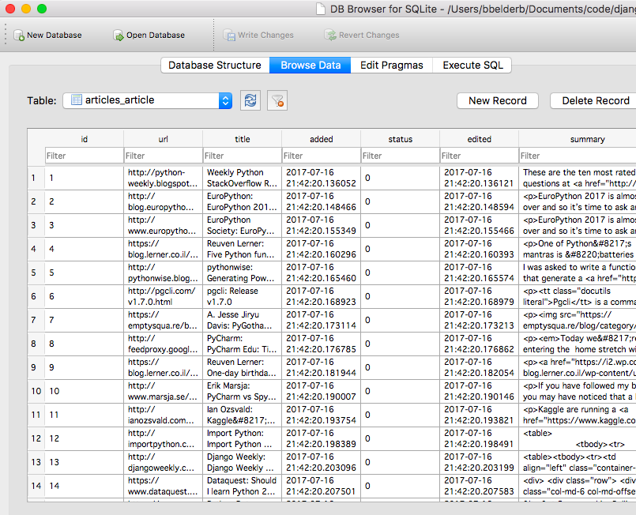

# pyplanet-django 

## about

Our first Djagno App!

This app lets you import [Planet Python's feed](http://planetpython.org) into an SQLite DB. 

The Django front-end shows the articles in a table:

Upon clicking each link it shows the parsed data and links to Tweet the article via Twitter's [Web Intents](https://dev.twitter.com/web/intents) (generated outgoing link) and update the status of the item: shared or skipped:

## try it yourself

	$ git clone git@github.com:pybites/pyplanet-django.git
	$ python3 -m venv venv && source venv/bin/activate
	$ pip install -r requirements.txt

Load Planet Python articles in:

(this was my 2nd run, I already had some items in the DB)

It uses an SQLite table to store the articles and status:

## TODOs (17/07/2017)

* Deploy to Heroku
* Automate `importfeed` [management command](https://docs.djangoproject.com/en/dev/howto/custom-management-commands/)
* Add user authentication and tracking who edits what (already field in the model)
* Integrate Twitter API so green "Mark Shared" button can be made redundant
