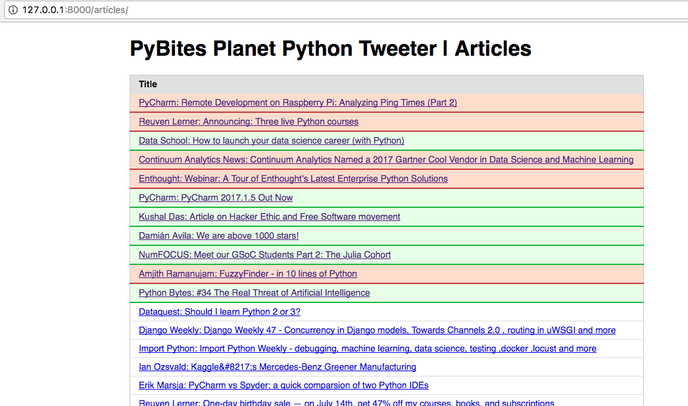
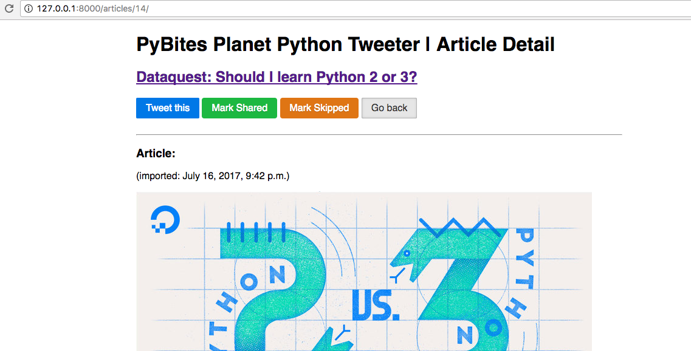
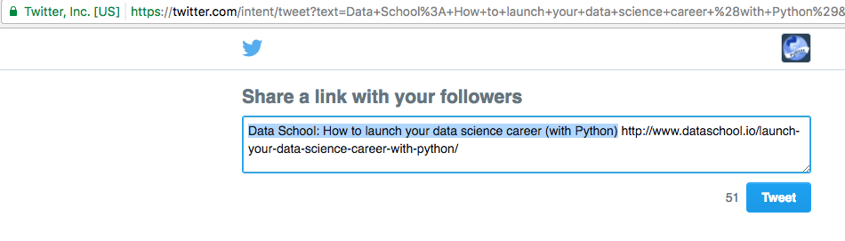
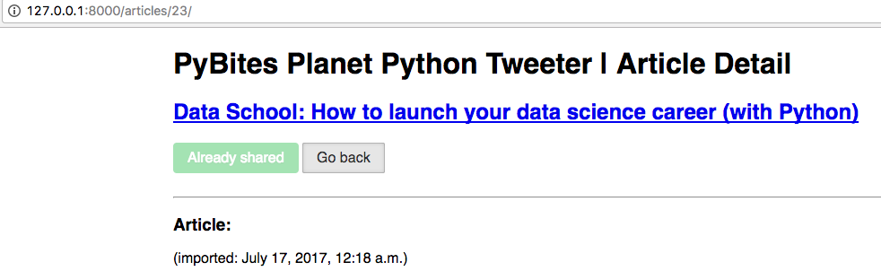

# pyplanet-django 

## about

Our first Djagno App!

This app lets you import [Planet Python's feed](http://planetpython.org) into an SQLite DB. 

The Django front-end shows the articles in a table:

Upon clicking each link it shows the parsed data and action buttons:

The "Tweet this" button uses Twitter's [Web Intents](https://dev.twitter.com/web/intents) (redirect to generated link) 

You can update the article as "Shared" or "Skipped" which is updated in the DB:

## try it yourself!

1. clone this repo:

		$ git clone git@github.com:pybites/pyplanet-django.git

2. make venv and install dependencies:

		$ python3 -m venv venv && source venv/bin/activate
		(venv) $ pip install -r requirements.txt

3. create DB tables (admin stuff to be added):

		(venv) $ python manage.py migrate
		Operations to perform:
		Apply all migrations: admin, articles, auth, contenttypes, sessions
		Running migrations:
		Applying contenttypes.0001_initial... OK
		...
		...
		Applying sessions.0001_initial... OK

4. run the [management command](https://docs.djangoproject.com/en/dev/howto/custom-management-commands/) to import Planet Python's feed:

		(venv) $ python manage.py importfeed
		Article id 1 created
		Article id 2 created
		...
		...
		Article id 25 created
		25 articles added

5. run local server: 

		(venv) $ python manage.py runserver

6. browse to [http://127.0.0.1:8000/](http://127.0.0.1:8000/)

## TODOs

* Deploy to Heroku or PythonAnywhere

* Add `importfeed` command to a cronjob

* Add user authentication and tracking who edits what (already field in the model)

* Integrate Twitter API so green "Mark Shared" button can be made redundant
